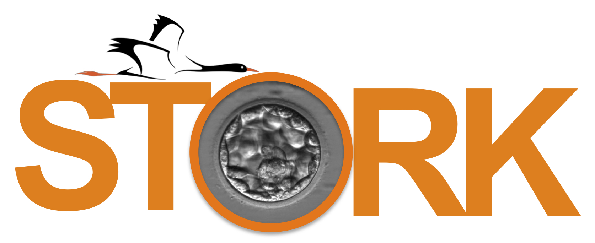

# Stork

Classify IVF images in real time.

[](https://www.python.org/downloads/release/python-360/)
[](https://opensource.org/licenses/MIT)



## Stork Requirements

- Docker. Get it from [here](https://www.docker.com/).
- `process` and `result` folders from ML training (Not included in this repository).

## Running Stork using Docker

### Load Environment Variables

```bash
DOCKER_CONTAINER_NAME=stork \
STORK_PORT=3000 \
OUTPUT_DIR=/stork/data/output/
UPLOAD_DIR=/stork/data/uploads/
PROCESS_DIR=/stork/data/process/
RESULT_DIR=/stork/data/result/
STORK_TAG=latest
```

### Run Docker Container

```bash
docker run -d --name ${DOCKER_CONTAINER_NAME} \
--restart on-failure:5 \
-p ${STORK_PORT}:80 \
-v ${OUTPUT_DIR}:/output \
-v ${UPLOAD_DIR}:/uploads \
-v ${PROCESS_DIR}:/stork/src/stork_src/process:ro \
-v ${RESULT_DIR}:/stork/src/stork_src/result:ro \
--env USERS_DICT="{ 'eipm': 'stork', 'embryology': 'RyJv3n', 'reviewer': 'e9wR8S' }" \
eipm/stork:${STORK_TAG}
```

Where:

- **${DOCKER_CONTAINER_NAME}**: The Stork docker container name.
- **${STORK_PORT}**: The Stork host port.
- **${OUTPUT_DIR}**: Where Stork image classification logs will be written.
- **${UPLOAD_DIR}**: Where Stork image will be saved.
- **${PROCESS_DIR}**: Required directory from ML training.
- **${RESULT_DIR}**: Required directory from ML training.
- **${USERS_DICT}**: The users credentials dictionary to authenticate.
- **${STORK_TAG}**: The stork version to deploy.
